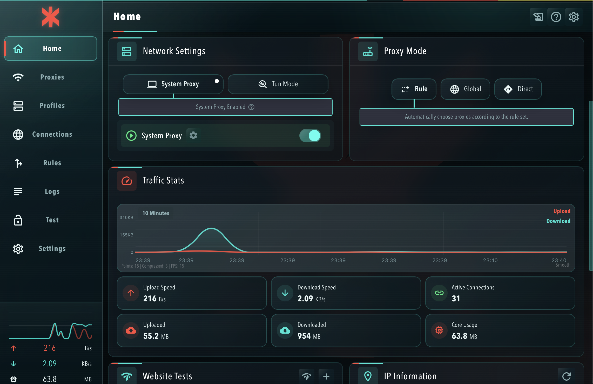
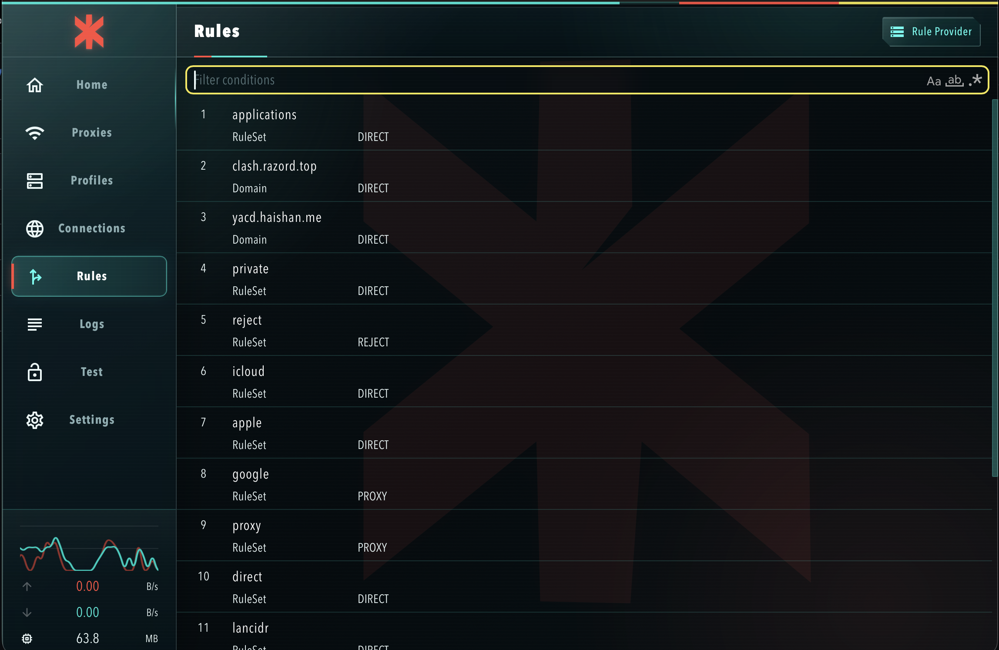
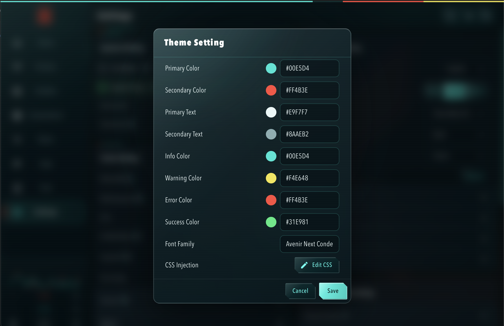

<div align="center">

# Trauma Team Liquid Glass

**适用于 Clash Verge Rev 的 Trauma Team 风格 Liquid Glass CSS 主题**

[](https://github.com/clash-verge-rev/clash-verge-rev/releases/latest)


[](./LICENSE)

深蓝黑医疗指挥终端、青色遥测界面、红色应急标识，以及接近 Liquid Glass 的分层毛玻璃质感。

[下载主题](./trauma-team-liquid-glass.css) · [安装教程](#安装与配置) · [许可证](./LICENSE) · [Clash Verge Rev Latest](https://github.com/clash-verge-rev/clash-verge-rev/releases/latest)

</div>

> [!IMPORTANT]
> 本项目是非官方用户自制主题，与 CD PROJEKT RED、Cyberpunk 2077、Trauma Team 及 Clash Verge Rev 项目均无隶属、合作或授权关系。相关名称、标志与视觉资产归各自权利人所有。

## 预览

### 首页与系统状态



### 规则页面



### Theme Setting



## 主题特点

- Trauma Team 风格的深蓝黑、医疗青、应急红与警示黄配色。
- 全局 Liquid Glass 毛玻璃卡片、侧栏、弹窗、菜单、输入框与工具栏。
- 左上角居中的 Trauma Team 标志。
- 页面中央静态、低透明度的红色 Trauma Team 水印。
- 保留轻微扫描纹理与顶部状态色条。
- 不使用远程图片、远程字体、`@import` 或 JavaScript。
- 不依赖 `.css-xxxxxx` 等构建时生成的 Emotion 哈希类名。
- 针对 Profiles、Connections、Rule Provider、Proxy Provider 等页面做了专项适配。
- 兼容 macOS 的“减少动态效果”和“减少透明度”辅助功能。

## 兼容性

| 项目 | 状态 |
|---|---|
| Clash Verge Rev | 针对 [Latest Release](https://github.com/clash-verge-rev/clash-verge-rev/releases/latest) 设计与验证 |
| macOS / Windows / Linux | 可用；主题使用系统字体回退，不同系统的字体与 WebView 渲染可能略有差异 |
| 深色模式 | 推荐并作为设计基准 |
| 浅色模式 | 不建议 |

> [!NOTE]
> Clash Verge Rev 后续若大幅重构页面结构或更换 UI 框架，少量组件可能需要重新适配。本主题优先使用语义布局类、公开 MUI 组件类和可访问性属性，以降低升级失效概率。

# 安装与配置

## 1. 下载 CSS

下载仓库根目录中的：

[`trauma-team-liquid-glass.css`](./trauma-team-liquid-glass.css)

打开文件并复制全部内容。

## 2. 固定深色模式

打开 Clash Verge Rev：

```text
Settings / 设置 → Verge Basic Settings / Verge 基础设置 → Theme Mode / 主题模式 → Dark / 深色
```

不建议选择“系统”，避免操作系统自动切换到浅色外观后出现组件色彩不一致。

## 3. 填写 Theme Setting

进入：

```text
Settings / 设置 → Theme Setting / 主题设置
```

按照下表填写：

| Theme Setting | 中文名称 | 值 |
|---|---|---|
| Primary Color | 主要颜色 |  `#00E5D4` |
| Secondary Color | 次要颜色 |  `#FF4B3E` |
| Primary Text | 文本主要颜色 |  `#E9F7F7` |
| Secondary Text | 文本次要颜色 |  `#8AAEB2` |
| Info Color | 信息颜色 |  `#00E5D4` |
| Warning Color | 警告颜色 |  `#F4E648` |
| Error Color | 错误颜色 |  `#FF4B3E` |
| Success Color | 成功颜色 |  `#31E981` |

Font Family / 字体系列填写：

```text
Avenir Next Condensed, Avenir Next, -apple-system, BlinkMacSystemFont, SF Pro Display, PingFang SC, Microsoft YaHei, sans-serif
```

这套字体栈不要求额外安装字体：

- macOS 英文优先使用系统自带的 Avenir Next 系列。
- 中文优先回退到 PingFang SC 或 Microsoft YaHei。
- Windows 与 Linux 会继续使用可用的系统字体或 `sans-serif`。

## 4. 注入 CSS

1. 点击 `CSS Injection / CSS 注入` 旁的 `Edit CSS / 编辑 CSS`。
2. 在 CSS 编辑器中全选原有内容。
3. 粘贴 `trauma-team-liquid-glass.css` 的完整内容。
4. 点击 CSS 编辑器内的保存。
5. 返回 Theme Setting 弹窗，再点击右下角的保存。
6. 完全退出 Clash Verge Rev：macOS 可按 `Command + Q`；Windows / Linux 请从托盘菜单退出应用。
7. 重新打开应用。

> [!TIP]
> CSS 编辑器和 Theme Setting 弹窗需要分别保存一次。只保存其中一处，重启后可能不会完整生效。

## 更新主题

更新 CSS 时建议完整替换旧内容，不要将新旧版本直接叠加：

1. 备份当前 CSS。
2. 用新版本完整替换旧 CSS。
3. 分别保存 CSS 编辑器与 Theme Setting 弹窗。
4. 完全退出并重新启动 Clash Verge Rev。

## 升级 Clash Verge Rev 后的检查

升级客户端后建议依次检查：

- 首页卡片、代理模式与流量统计。
- Profiles 订阅卡片、拖动按钮与更新按钮。
- Proxies 代理组与节点卡片。
- Connections 表头、列表与筛选栏。
- Rules、Rule Provider 与更新按钮。
- Settings、Dialog、Menu、Popover 与输入框。

若主题完全没有生效：

1. 确认主题模式仍为深色。
2. 确认 CSS Injection 内容仍在。
3. 重新保存 CSS 编辑器和 Theme Setting。
4. 完全退出并重新打开应用。

若升级后界面难以操作，可暂时清空 CSS Injection 并保存，恢复默认外观。

## 设计语言

| 颜色 | 用途 |
|---|---|
|  `#00E5D4` | 医疗遥测、连接状态、主要交互 |
|  `#FF4B3E` | 紧急响应、危险操作、Trauma Team 标志 |
|  `#F4E648` | 工业安全与警示信息 |
|  `#31E981` | 成功、在线与系统正常状态 |
|  `#E9F7F7` | 临床白主文字，避免纯白过度刺眼 |
|  `#8AAEB2` | 冷灰蓝辅助文字 |

## 稳定性策略

主题刻意避免：

- `.css-xxxxxx` 等 Emotion 构建哈希类。
- 网络背景图与外链字体。
- 持续漂移、旋转或缩放的大型动画。
- JavaScript 注入。
- 无差别覆盖所有组件的宽泛透明规则。

主题优先使用：

- Clash Verge Rev 的语义布局类。
- MUI 公开组件类。
- `aria-label`、`aria-selected`、`data-testid` 等稳定属性。
- 静态渐变、SVG Data URI 与有限范围的 `backdrop-filter`。

## 性能说明

Liquid Glass 视觉主要依赖 `backdrop-filter`。在较旧的设备、低功耗模式或远程桌面环境中，窗口拖动与滚动可能比默认主题更消耗 GPU。

macOS 用户可在系统设置中启用“减少透明度”，主题会自动降低或关闭部分透明材质；小窗口下也会降低部分效果强度。

## 项目结构

```text
.
├── assets/
│   ├── colors/
│   │   ├── 00e5d4.svg
│   │   ├── 31e981.svg
│   │   ├── 8aaeb2.svg
│   │   ├── e9f7f7.svg
│   │   ├── f4e648.svg
│   │   └── ff4b3e.svg
│   ├── home-dashboard.png
│   ├── rules-page.png
│   └── theme-settings.png
├── .gitignore
├── LICENSE
├── trauma-team-liquid-glass.css
└── README.md
```

## 许可证

本项目中的 CSS 代码和项目文档依据 [MIT License](./LICENSE) 发布。

Cyberpunk 2077、Trauma Team、Clash Verge Rev 等名称、商标、标志及其他第三方视觉资产不属于本项目的 MIT 授权范围，其权利归各自权利人所有。

## 免责声明

本项目仅用于个人界面美化与学习交流。请勿将本主题或相关标志用于商业宣传、冒充官方产品、误导性发行，或暗示获得官方授权。

## 致谢

- [Clash Verge Rev Latest Release](https://github.com/clash-verge-rev/clash-verge-rev/releases/latest)
- Cyberpunk 2077 与 Trauma Team 的世界观和视觉设计

---

<div align="center">

**Trauma Team Liquid Glass · Secure link established.**

</div>